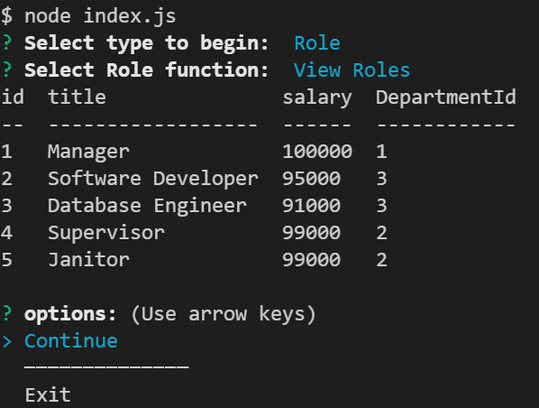

# Employee Tracker CLI

  

  

          
### Description 

Managing a companies employee database, add, update, delete and view records

### Table of Contents

* [Usage Guide](#Usage-Guide)
* [Install Instructions](#Installation)
* [Technologies Used](#Technologies-Used)
* [Contributions](#Contributions)
* [Tests](#Tests)
* [Questions](#Questions)

## Usage Guide 

demonstrating database management functions in web application

Watch [this](https://drive.google.com/file/d/1xYpVD1gesTMzuDcjNIH77cKjG8_SYv2z/view) video to learn more 

## Installation 

Create Database using schema.sql

`CREATE DATABASE employee_tracker_db;`

To Install

`NPM install` 

To Run

`Node index.js`

## Technologies Used 

Sequelize, Node, MySQL, Inquirer

## Contributions 

This is currently my own work. Please feel free to submit your contributions on GITHUB with credits given

## Tests 

Future testing planned using Jest testing framework

## Questions 

If you have any questions or want to keep up with my latest projects, please follow me on [Github](http://www.github.com/operationBrass) or contact me via [Email](mr.brn.lewis@outlook.com). 
